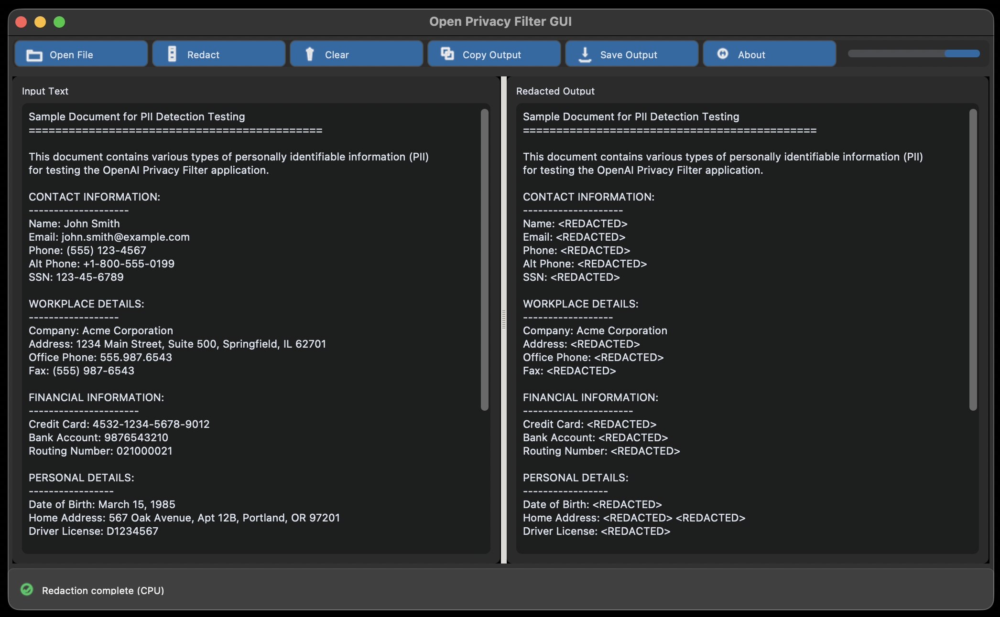

# Open Privacy Filter GUI

A lightweight, drag-and-drop Python desktop application for redacting sensitive data from text using OpenAI's Privacy Filter model.



## ✨ Features

- **Drag & drop** text files directly into the input area
- **One-click redaction** with real-time output
- **Copy to clipboard** or **save as new file**
- Clean, minimal Tkinter interface
  - Optional: modern CustomTkinter interface also available
- Works on Windows, macOS, and Linux

## 📦 Requirements

| Package | Install Command |
|---------|-----------------|
| Python 3.8+ | See [python.org](https://www.python.org/) |
| `tkinter` | Usually bundled with Python |
| `tkinterdnd2` | `pip install tkinterdnd2` |
| `torch` | `pip install torch` |
| `customtkinter` (optional) | `pip install customtkinter` |
| `image` (optional) | `pip install image` |
| OpenAI Privacy Filter | See setup steps below |

## 🚀 Quick Setup

```bash
# 1. Clone and install the OpenAI Privacy Filter
git clone https://github.com/openai/privacy-filter.git
cd privacy-filter
pip install -e .

# 2. Install dependencies for classic UI
pip install tkinterdnd2 torch

# 3. (Optional) Install customtkinter and image for modern UI
pip install customtkinter image
```

## 💡 Usage

### Launch the App

**Terminal:**
```bash
python opftk.py
```

Or, if you prefer the more modern CustomTkinter interface:

```bash
python opftk_modern.py
```

**Windows:**
1. Double-click `launch.bat`
2. *(Optional)* Copy `launch.bat` to your Desktop → right-click → **Paste shortcut** → rename to *OpenAI Privacy Filter GUI* for quick access.

If you prefer to use the modern CustomTkinter interface, substitute `launch_modern.bat` for `launch.bat`.

### Workflow

1. **Input** – Drag a `.txt` file into the left panel, or click **Open** to browse.
2. **Redact** – Click **Redact**. The model processes the text and displays results in the right panel.
3. **Export** – Click **Copy Output** to clipboard, or **Save Output** to write a new file.
4. **Clear** – Reset both panels to start fresh.
5. **Quit** – Close the window or use the system close button.

## 🔧 Troubleshooting

| Issue | Fix |
|-------|-----|
| `launch.bat` fails on Windows | Ensure Python is in your `PATH` |
| Slow redaction | Run on GPU (CUDA) or reduce input text size |

## 📁 Project Structure

```
openai-privacy-filter-gui/
├── opftk.py                     # Main GUI application
├── opftk_modern.py              # Main GUI application (Modern)
├── launch.bat                   # Windows launcher
├── launch_modern.bat            # Windows launcher (Modern)
├── test-document.txt            # Test input file
├── opftk_modern_screenshot.png  # Modern theme GUI screenshot
└── README.md                    # This file
```

## 📝 License

Apache 2.0 License. See [LICENSE](LICENSE.txt) for details.
